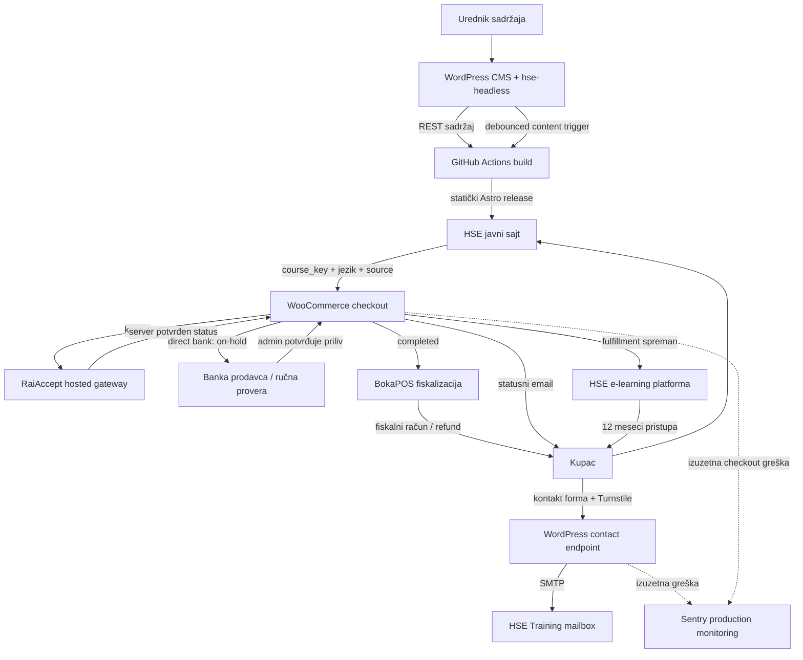

# HSE Training - tehnička dokumentacija sistema

**Status dokumenta:** produkcioni pregled  
**Poslednje usklađivanje sa repozitorijumom:** 4. oktobar 2026.  
**Obuhvat:** Astro frontend, WordPress CMS, WooCommerce, RaiAccept, BokaPOS,
kontakt forma, emailovi, bezbednost, monitoring i deployment.

## 1. Svrha dokumenta

Ovaj dokument opisuje kako je HSE Training sistem tehnički organizovan i kako
se ponaša od izmene sadržaja do kupovine, fiskalizacije, refundacije i isporuke
informacija kupcu. Namenjen je developerima, administratorima sajta i tehničkoj
podršci. Tehnički termini su zadržani tamo gde su važni za tačnost, ali je uz
svaki proces objašnjena njegova praktična svrha.

Dokument opisuje stanje koda i usvojenu produkcionu arhitekturu. Tajne vrednosti
- lozinke, privatni ključevi, payment kredencijali, SMTP lozinka, Turnstile
secret i GitHub token - namerno nisu deo dokumentacije niti repozitorijuma.

## 2. Arhitektura na visokom nivou

Sistem je podeljen na više jasno odvojenih odgovornosti:

| Komponenta | Tehnička uloga | Poslovna odgovornost |
|---|---|---|
| Astro frontend | statički generisan javni sajt | prezentacija sadržaja i ulaz u checkout |
| WordPress CMS | uređivanje sadržaja i kontrolisani REST API | vlasnik objavljenog marketinškog sadržaja |
| WooCommerce | checkout i skladište poslovnog stanja | porudžbine, statusi, kupci, emailovi i refundacije |
| RaiAccept | hostovani bankarski payment gateway | autoritativni ishod kartičnog plaćanja i bankarske refundacije |
| BokaPOS | integracija sa e-fiskalizacijom | konačni fiskalni račun i fiskalna refundacija |
| HSE e-learning platforma | eksterni LMS | nalog polaznika, pristup i realizacija kursa |
| GitHub Actions | CI/CD automatizacija | validacija, build, deployment i rollback |

Ključna arhitektonska odluka je da Astro bude javna aplikacija, a da WordPress
ne renderuje drugi paralelni marketinški sajt. WordPress ostaje headless CMS i
ograničeni commerce host. Checkout, `order-pay`, `order-received`, REST, AJAX,
cron i payment callback rute ostaju dostupne jer su neophodne za transakcioni
tok; obične WordPress theme rute vraćaju 404 ili kontrolisani redirect.

## 3. Okruženja i izolacija podataka

| Okruženje | Git branch | Javni frontend | CMS | Infrastruktura |
|---|---|---|---|---|
| Staging | `main` | `https://staging.hsetraining.rs` | `https://staging-cms.hsetraining.rs` | Astro na Hetzneru, CMS na Unlimited.rs |
| Production | `production` | `https://hsetraining.rs` | `https://cms.hsetraining.rs` | Astro i CMS na Unlimited.rs |

Staging CMS je zasebna WordPress instalacija sa posebnom bazom, uploads
direktorijumom, sesijama i sandbox payment/fiscal kredencijalima. Produkcioni
CMS ima svoju bazu, produkcione kredencijale i produkcionu konfiguraciju.
Promena sadržaja, plugina, baze ili fajlova u jednom CMS-u ne prelazi
automatski u drugi.

Dev okruženje je uklonjeno iz aktivne infrastrukture. Lokalni razvoj ostaje
moguć kroz lokalni Astro i lokalni WordPress runtime, bez povezivanja na
produkcione servise.

### 3.1. Zašto je izolacija važna

- Test porudžbine ne mogu da zagade produkcionu bazu.
- Sandbox gateway i fiskalizacija ne mogu slučajno da postanu realna transakcija.
- Staging sadržaj ne može automatski da promeni javni sajt.
- Sentry događaji sa staginga se ne mešaju sa produkcionim incidentima.
- Produkcioni backup i rollback ostaju nezavisni od testiranja.

## 4. Struktura repozitorijuma

```text
HSE-training/
├── apps/web/                         Astro 7 + TypeScript aplikacija
├── wordpress/plugins/hse-headless/  prilagođeni WordPress plugin
├── docs/                             tehnička, API i ADR dokumentacija
├── infra/apache/                     produkciona Apache/LiteSpeed pravila
├── infra/nginx/                      staging Nginx konfiguracija
├── infra/robots/                     robots pravila za nejavna okruženja
├── scripts/                          deployment i konfiguracioni alati
└── .github/workflows/                GitHub Actions CI/CD
```

Repozitorijum ne sadrži WordPress core, produkcionu bazu, uploads kopiju,
payment kredencijale ili server `wp-config.php`. On sadrži samo kod i
konfiguracione obrasce koje tim kontroliše.

## 5. Astro javni frontend

### 5.1. Statički build

Astro generiše statički HTML, CSS i minimalni JavaScript. Rezultat se servira
bez Node procesa na produkcionom serveru. Time se smanjuje napadna površina,
ubrzava učitavanje i pojednostavljuje hosting na shared infrastrukturi.

Tok build-a je:

1. CI instalira zaključane npm zavisnosti sa `npm ci`.
2. Pokreću se unit testovi, Astro/TypeScript provera i ESLint.
3. Astro čita objavljene CMS REST odgovore za engleski i srpski sadržaj.
4. Adapteri validiraju i mapiraju raw WordPress podatke u domenske tipove.
5. Nevalidan obavezan odgovor, dupli ključ ili nedostajuća lokalizacija prekida build.
6. Uspešan build proizvodi `dist/` spreman za atomsku objavu.

Frontend zato nikada tiho ne objavljuje nepotpunu stranicu samo zato što je CMS
vratio neispravan odgovor.

### 5.2. Dvojezičnost i SEO

- Engleski je podrazumevani jezik na neprefiksiranim rutama.
- Srpski koristi `/sr/` i `sr-Latn` metadata.
- Svaki jezik ima realnu, indeksabilnu rutu.
- Prevod kursa se povezuje preko stabilnog `course_key`, ne preko WordPress ID-a
  ili slučajno jednakog slug-a.
- Stranice imaju canonical i `hreflang` podatke.
- Sitemap generiše Astro integracija; skriveni produkcioni test proizvod je
  eksplicitno isključen.
- `robots.txt` upućuje pretraživače na sitemap.
- Stara ruta `/training-schedule/` trajno se preusmerava na `/training/`.
- Open Graph i Twitter metadata koriste HSE Training logo pri deljenju linka.

### 5.3. CMS podaci koje frontend koristi

Astro iz CMS-a čita:

- hero slajdove;
- Company i Homepage sadržaj;
- kurseve i treninge;
- usluge;
- reference;
- free resources: linkove, video sadržaj i dokumente;
- legalne stranice;
- javnu commerce projekciju kursa i checkout URL.

Header, footer, route struktura, CSS, responsive ponašanje, animacije i većina
interfejs tekstova ostaju u Astro kodu. Time CMS urednik može da menja sadržaj,
ali ne može nenamerno da naruši layout ili poslovnu logiku.

### 5.4. Responsive i pristupačni UI

Frontend koristi semantički HTML, CSS Grid/Flexbox i projektne komponente bez
Elementor/Crafto runtime zavisnosti. Layout je prilagođen telefonu, tabletu,
laptopu i velikom desktopu. Interaktivne kontrole dobijaju fokus, labelu i
stanje, a kritični tokovi kao checkout imaju čitljivu hijerarhiju, velike zone
klika i jasnu povratnu informaciju.

## 6. WordPress CMS i `hse-headless` plugin

Repozitorijumski plugin `hse-headless` je integracioni sloj između WordPressa,
Astro-a i WooCommerce-a. Aktuelna verzija u repozitorijumu je **0.35.0**.

### 6.1. Model sadržaja

Plugin registruje i validira:

- Course i Training zapise;
- Hero Slides sa minimalnom dimenzijom slike 1600 x 900 i preporukom 1920 x 1080;
- Service, Reference i Free Resource kolekcije;
- Company, Homepage, Course Page i Legal Page podešavanja;
- odvojene `en` i `sr` varijante sa stabilnim poslovnim ključevima.

REST kontroleri izlažu samo polja potrebna javnom sajtu. Astro stranice ne
zavise od internog WordPress post ID-a i ne čitaju bazu direktno.

### 6.2. Automatska objava iz CMS-a

Astro je statički, pa snimanje u CMS-u ne menja već generisani HTML. Zbog toga
produkcioni CMS ima kontrolisani content-deploy trigger:

1. Urednik sačuva podržani javni sadržaj ili Media Library prilog.
2. Plugin zakazuje jedan debouncovani WP-Cron događaj.
3. Realni server cron izvršava događaj.
4. CMS ograničenim GitHub tokenom pokreće produkcioni workflow na branchu `production`.
5. Workflow validira CMS podatke, pravi build, aktivira izdanje i radi smoke testove.

Više brzih izmena se spaja u jedan deployment. WooCommerce porudžbine,
refundacije i druge operativne promene nikada ne pokreću frontend build.

Token ima minimalno pravo samo na Actions za ovaj repozitorijum, čuva se u
privatnoj serverskoj konfiguraciji i ne ulazi u bazu, plugin ZIP, log ili
browser bundle.

## 7. Katalog kurseva i veza sa WooCommerce-om

`course_key` je stabilni identitet kursa kroz ceo sistem:

```text
WordPress Course.course_key
        = WooCommerce Product SKU
        = Astro business key
        = metadata porudžbine / fulfillment identitet
```

Objavljeni Course je urednički izvor. Plugin iz njega pravi ili ažurira skriveni
WooCommerce virtualni proizvod. Polje **Available for online purchase** odlučuje
da li postoji Buy now opcija, a **Online price** je autoritativna checkout cena.
Display cena na javnoj stranici nije automatski payment iznos.

Astro dobija samo javnu projekciju: naziv, valutu, cenu u minor jedinicama,
dostupnost i bezbedan checkout-initiation URL. WooCommerce product ID,
gateway ključevi i poverljiva podešavanja se ne izlažu browseru.

## 8. Checkout i podaci kupca

Kupac iz Astro stranice otvara CMS checkout kroz allowlisted putanju sa
`course_key`, jezikom i izvorom okruženja. Server:

1. proverava format ključa;
2. pronalazi skriveni WooCommerce proizvod po SKU;
3. potvrđuje da je kurs dostupan i ima validnu cenu;
4. prazni prethodnu korpu i dodaje tačno jedan kurs;
5. preusmerava korisnika na WooCommerce checkout.

Checkout je vizuelno prilagođen HSE brendu, ali koristi WooCommerce poslovnu
logiku i validaciju. Čuva izabrani jezik i izvor na porudžbini, tako da emailovi,
retry ekran i order-received ekran ostaju u pravilnoj lokalizaciji.

### 8.1. Fizičko i pravno lice

- Fizičko lice ne vidi PIB/TIN i matični broj.
- Pravno lice iz Srbije unosi naziv i devetocifreni PIB. PIB prolazi format i
  ISO 7064 MOD 11,10 kontrolnu cifru, ali se ne proverava postojanje firme u
  APR-u. Opcioni matični broj ima osam cifara.
- Srpski PIB se šalje BokaPOS-u kao identifikacija `10:PIB`.
- Strano pravno lice unosi Tax/VAT identification number. Zadržana je minimalna
  bezbedna provera dozvoljenih karaktera i dužine, bez validacije prema registru
  svake države. BokaPOS mapiranje je `40:TIN`.

Kupac posebno prihvata Uslove/Politiku privatnosti i posebno, nepreselektovanim
checkbox-om, zahteva trenutnu isporuku digitalnog kursa. Verzija teksta i UTC
vreme saglasnosti ostaju na porudžbini.

## 9. Kartično plaćanje preko RaiAccept-a

RaiAccept je hostovani payment gateway. Kartični broj, CVC i autentifikacioni
podaci nikada ne prolaze kroz Astro ili HSE browser kod.

### 9.1. Uspešan tok

1. WooCommerce kreira porudžbinu i tačan iznos u RSD.
2. Zvanični RaiAccept plugin kreira bankarsku payment sesiju.
3. Kupac unosi karticu na bankarskoj strani.
4. Browser return služi samo za UX; nije dokaz uspeha.
5. Server integracija prihvata autoritativni status i proverava vezu sa
   porudžbinom, iznosom, valutom i provider referencom.
6. Plaćena porudžbina koja sadrži samo sinhronizovane virtualne kurseve prelazi
   direktno u `completed`.
7. WooCommerce šalje jedan brendirani završni email i pokreće fulfillment tok.
8. BokaPOS izdaje konačni fiskalni račun.

Ne koristi se avansni račun, jer kupac nakon potvrđene kupovine dobija pravo na
trenutni pristup kursu. BokaPOS je podešen da fiskalizuje završenu prodaju.

### 9.2. Neuspeh i ponovni pokušaj

Kod odbijenog plaćanja porudžbina dobija odgovarajući neuspešan status i kupac
prima brendirani email sa potpisanim WooCommerce `order-pay` linkom. Link prvo
otvara pregled postojeće porudžbine; samo eksplicitno slanje forme pokreće novi
payment pokušaj.

RaiAccept ne dozvoljava ponovno korišćenje neaktivne payment sesije niti istog
merchant reference-a. `hse-headless` zato, bez izmene zvaničnog RaiAccept
plugina, arhivira staru provider referencu, generiše jedinstvenu retry referencu
i uklanja samo neaktivni session metadata. Time novi pokušaj ostaje vezan za
istu WooCommerce porudžbinu, ali je za banku nova transakcija.

### 9.3. Idempotentnost

Gateway može poslati isti ili preklapajući callback više puta. Sistem zato ne
sme da ponovi poslovnu posledicu. Za završni customer email koristi se atomski,
ne-autoload database claim i trajni marker uspešne isporuke. Samo prvi callback
može da pošalje poruku; neuspešan send oslobađa claim, uspešan ga zatvara.

Isti princip se primenjuje na statuse, refund reference i fiskalne operacije:
provider identifikatori i istorija se čuvaju radi usklađivanja, a ponovljena
notifikacija ne stvara novu porudžbinu ili novu poslovnu akciju.

## 10. Direct bank transfer

WooCommerce `bacs` je ručni bankovni transfer, ne instant Open Banking/IPS
gateway. Kupac dobija instrukcije i sam izvršava nalog u svojoj banci.

- Domaći kupac dobija Uplatnicu ili Nalog za prenos, zavisno od customer type.
- Strani kupac dobija beneficiary podatke, IBAN, SWIFT/BIC i zvanični
  Raiffeisen PDF sa EUR instrukcijama.
- Porudžbina ostaje `on-hold`.
- Sistem ne zaključuje iz browsera da je uplata stigla.
- Administrator proverava izvod/račun prodavca i tek tada ručno menja status u
  `completed`.
- Tek `completed` aktivira završni email, fulfillment i BokaPOS konačni račun.

Ovaj tok je namerno odvojen od kartice da kurs i fiskalizacija ne počnu pre
stvarno primljenog novca.

## 11. BokaPOS fiskalizacija

BokaPOS je jedini autoritet za postojanje fiskalnog dokumenta. WooCommerce
status sam po sebi nije dokaz da je fiskalni račun izdat; dokaz su BokaPOS/PFR
status, broj dokumenta i verifikaciona veza.

### 11.1. Prodaja

- BokaPOS se pokreće na `completed`.
- `raiaccept` se mapira na karticu, a `bacs` na bankarski transfer.
- Produkcija koristi BokaPOS email kanal kao jedini kanal za zvanični fiskalni
  dokument, da kupac ne dobije duplikat istog računa iz WooCommerce-a.
- WooCommerce i dalje šalje odvojeni poslovni email o statusu porudžbine.
- Jezik wrapper poruke prati jezik checkout-a, odnosno engleski za stranog
  kupca; zakonski PDF ostaje u propisanom formatu i jeziku.

Kompatibilni sloj ne menja zvanični BokaPOS plugin. On rešava samo integracione
detalje u našem pluginu i čuva update-safe granicu. Zvanične provider update-e
uvek treba prvo testirati u staging sandboxu.

### 11.2. Refundacija

Finansijska i fiskalna refundacija su dve povezane, ali različite operacije:

1. Administrator u WooCommerce refund formi unese vraćenu količinu uz kurs.
2. Uključi fiskalizaciju refundacije.
3. Pokrene refund preko RaiAccept-a.
4. RaiAccept vraća novac na originalni payment instrument.
5. BokaPOS kreira fiskalnu refundaciju povezanu sa originalnim fiskalnim računom.
6. Kupac dobija WooCommerce refund potvrdu i poseban BokaPOS fiskalni dokument.

Amount-only refund može finansijski vratiti sredstva, ali BokaPOS bez line
quantity ne može ispravno da fiskalizuje povraćaj. Zato browser i serverska AJAX
validacija zahtevaju pozitivnu količinu kada je izabrano **Fiscalize this
refund**. Već uspešnu bankarsku refundaciju nikada ne treba ponovo slati samo
zato što je fiskalni deo ranije pogrešno popunjen; tada se radi kontrolisana
fiskalna korekcija sa BokaPOS podrškom.

Vreme knjiženja novca kupcu zavisi od banke i kartične šeme i nije pod kontrolom
WooCommerce-a, RaiAccept plugina ili HSE frontenda.

## 12. Email arhitektura

Emailovi imaju dve različite svrhe:

| Kanal | Šta potvrđuje |
|---|---|
| WooCommerce/HSE | porudžbinu, status plaćanja, instrukcije ili refundaciju |
| BokaPOS | zvanični fiskalni račun ili fiskalnu refundaciju |

`hse-headless` poseduje responsive HTML i plain-text templejte za completed,
failed, cancelled, on-hold, refunded i merchant obaveštenja. Customer email se
uvek šalje na billing adresu. Admin primalac je serverski konfigurisan po
okruženju; ne zavisi od slučajno importovanog WordPress administrator emaila.

SMTP autentifikacija i sender žive u privatnoj serverskoj konfiguraciji. Nakon
uspešnog slanja na porudžbini ostaje samo tip obaveštenja i UTC vreme kao
operativni dokaz, bez dodatnog dupliranja sadržaja poruke.

## 13. Kontakt forma i Cloudflare Turnstile

Kontakt forma šalje JSON na `POST /wp-json/hse/v1/contact`. Produkcioni tok:

1. Astro prikazuje Turnstile widget sa javnim site key-em.
2. Forma se ne šalje bez jednokratnog tokena.
3. WordPress proverava tipove, dužine i obavezna polja.
4. Origin mora biti na allowlisti.
5. Honeypot apsorbuje jednostavne botove.
6. Rate limit ograničava prihvaćene poruke i skupe Turnstile provere.
7. Server šalje token direktno Cloudflare-u i proverava hostname i action `contact`.
8. Tek nakon uspešne provere šalje se email kroz autentifikovani SMTP.
9. Browser dobija generičan lokalizovan rezultat i resetuje token.

Turnstile secret nikada nije deo Astro build-a. Forma ne kreira WordPress
korisnika, post, custom table zapis ili trajni kontakt zapis. U bazi privremeno
ostaje samo salted nereverzibilni hash klijenta i brojač za rate limit. Poslovni
sadržaj upita postoji samo u odredišnom mailbox-u i podleže politici čuvanja tog
mailbox-a.

## 14. Sentry i operativno praćenje

Aktuelni Sentry obuhvat je namerno uzak:

- aktivan je samo u produkciji;
- Astro browser SDK se inicijalizuje samo na `/contact/` i `/sr/contact/`;
- CMS prijavljuje samo izuzetne greške pri kreiranju produkcione porudžbine,
  izuzetne RaiAccept request greške i neuspeh produkcione kontakt isporuke;
- normalno odbijena kartica, validation error, uspešna porudžbina i opšti page
  view nisu incidenti;
- staging i lokalno okruženje nemaju Sentry DSN;
- Session Replay je isključen;
- ne šalju se korisnički identitet, cookies, headeri, body, query parametri,
  vrednosti kontakt forme ili stack promenljive.

BokaPOS fiskalizacije i refundacije se više ne prate custom Sentry watchdog-om.
Za njih su autoritativni BokaPOS portal, njegova upozorenja/isporuke,
WooCommerce order notes/logovi i privatni server logovi.

Realni server cron i dalje radi svake minute, sa lock-om, timeout-om, privatnim
logom i heartbeat fajlom. On pokreće dospele WP-Cron događaje i ograničeni
Action Scheduler batch, što je važno za WooCommerce, provider retry/poll poslove,
emailove i content deploy trigger. `DISABLE_WP_CRON` sme ostati uključen samo dok
ovaj server cron pouzdano radi.

## 15. Bezbednosne kontrole

### 15.1. Implementirano u kodu/infrastrukturi

- HTTPS i HSTS bez `includeSubDomains/preload` proširenja.
- CSP za `base-uri`, `object-src`, `frame-ancestors` i mixed-content upgrade.
- `X-Content-Type-Options`, `X-Frame-Options`, Referrer Policy i Permissions Policy.
- Uklonjen `X-Powered-By` odgovor.
- Blokirani XML-RPC, `readme.html`, `license.txt`, javni log fajlovi i directory listing.
- WordPress theme frontend zatvoren; javne su samo eksplicitno potrebne rute.
- Nekorišćene Woo rute (`shop`, `cart`, product taxonomy, `my-account`, order
  tracking) vode na kontrolisani javni početak umesto generičkog store-a.
- Staging frontend je zaštićen HTTP Basic Authentication-om.
- Tajne su u GitHub environment secrets/variables ili privatnim server fajlovima.
- GitHub Actions third-party akcije su pinovane na konkretne commit SHA vrednosti.
- Payment i fiskalni provider plugin kod se ne menja direktno.
- Produkcioni PHP/Woo logovi su van public document root-a ili HTTP blokirani.

### 15.2. Operativne kontrole

- Administratorski nalozi moraju imati jake jedinstvene lozinke i TOTP 2FA.
- Recovery kodovi se čuvaju odvojeno, a hosting recovery put mora biti testiran.
- WordPress, WooCommerce, RaiAccept i BokaPOS update se prvo proveravaju uz
  backup i staging regresiju.
- Baza i uploads zahtevaju šifrovan off-site backup i periodični restore test.
- Logove i rezervne Astro/plugin verzije treba periodično pregledati i čistiti
  tek posle potvrđenog stabilnog izdanja.

Repozitorijum sadrži proceduru za 2FA, ali njegov stvarni status mora da se
proveri u produkcionom administratoru; to nije stanje koje Git može sam da dokaže.

## 16. Deployment proces

### 16.1. Staging Astro - branch `main`

Workflow `.github/workflows/deploy-staging.yml`:

1. pokreće se za relevantne Astro fajlove na `main` ili ručno;
2. gradi protiv `staging-cms.hsetraining.rs`;
3. izvršava test, type/Astro check, lint i build;
4. uploaduje u novi Hetzner `releases/<release-id>` direktorijum;
5. atomskim symlink prebacivanjem aktivira `current`;
6. proverava homepage, contact i resources, uz HTTP auth;
7. vraća prethodni symlink ako smoke test ne prođe.

### 16.2. Production Astro - branch `production`

Workflow `.github/workflows/deploy-production.yml`:

1. gradi protiv `cms.hsetraining.rs` sa production checkout source-om,
   Turnstile site key-em i ograničenim Sentry podešavanjem;
2. pokreće sve quality gate provere;
3. dodaje produkciona Apache routing/security pravila;
4. uploaduje kompletno izdanje u nejavni release direktorijum;
5. pravi privatni backup aktivnog sajta;
6. aktivira novi sadržaj u `public_html` kada je deployment flag omogućen;
7. čuva hosting fajlove koji ne pripadaju build-u, kao što su `.well-known`,
   `.htpasswd` i PHP konfiguracija;
8. radi smoke testove i automatski vraća prethodni backup ako provera padne.

### 16.3. WordPress plugin

Workflow `.github/workflows/deploy-production-plugin.yml` je ručan i odvojen od
Astro deployment-a. On:

- pakuje `hse-headless` ZIP;
- proverava ZIP i SHA-256 checksum;
- proverava PHP sintaksu;
- pravi privatni backup prethodnog plugin direktorijuma;
- instalira očekivanu verziju;
- pokreće kontakt REST integracioni test bez realnog emaila;
- automatski vraća prethodnu verziju na bilo kom neuspehu.

WordPress baza, uploads i core nikada se ne kopiraju Astro workflow-om.

### 16.4. Server-only konfiguracija

Posebni ručni workflow-i instaliraju:

- ograničeni GitHub token za production CMS content trigger;
- Turnstile secret, hostname/action politiku i enforcement flag.

Vrednosti se generišu u privremenom CI fajlu, šalju SSH-om u privatnu lokaciju,
povezuju iz `wp-config.php`, validiraju bez štampanja tajne i zatim brišu iz CI
radnog prostora.

## 17. Testiranje i release kontrola

Minimalni tehnički quality gate za Astro je:

```sh
cd apps/web
npm ci
npm run test
npm run check
npm run lint
npm run build
```

Za CMS plugin postoje WP-CLI integracioni testovi po modulu. Pre produkcionog
commerce izdanja obavezno se prolaze najmanje sledeći scenariji:

1. uspešna kartica -> `completed` -> jedan Woo email -> BokaPOS račun;
2. dupli/preklapajući RaiAccept callback -> bez duplog emaila ili fiskalizacije;
3. odbijena kartica -> failed email -> novi retry reference -> uspešan retry;
4. domaći BACS -> `on-hold` -> instrukcije -> ručna potvrda -> `completed`;
5. strani BACS -> IBAN/SWIFT i EUR PDF;
6. puna i parcijalna refundacija sa line quantity -> RaiAccept i BokaPOS refund;
7. neuspešna fiskalna operacija -> vidljiva u BokaPOS/Woo administraciji;
8. EN i SR customer type/PIB/TIN validacija;
9. kontakt sa validnim Turnstile tokenom -> jedan email;
10. kontakt bez tokena, sa pogrešnim originom ili preko limita -> odbijen;
11. CMS izmena javnog sadržaja -> jedan debouncovani production build;
12. neuspešan deployment smoke test -> vraćen prethodni release.

## 18. Operativna podela odgovornosti

| Događaj | Gde se prvo proverava |
|---|---|
| sadržaj nije osvežen | CMS deploy notice, GitHub production workflow, Astro build log |
| kartica odbijena | Woo order notes i RaiAccept provider status |
| porudžbina ostala processing | payment status, gateway callback i order lifecycle log |
| fiskalni račun nije izdat | BokaPOS operacija/PFR status i Woo order notes |
| fiskalni email nije stigao | BokaPOS email delivery evidencija |
| refund novac kasni | RaiAccept refund status, zatim banka/kartična šema |
| fiskalna refundacija nije moguća | originalni račun i vraćena line quantity |
| kontakt nije stigao | Turnstile rezultat, REST request ID, SMTP i Sentry incident |
| deployment nije uspeo | GitHub Actions log, smoke test i rollback rezultat |

## 19. Dijagram celog procesa



### 19.1. Čitanje dijagrama

- Gornji tok opisuje uređivanje sadržaja i statičku objavu.
- Srednji tok opisuje kupovinu karticom ili ručnim bank transferom.
- `completed` je zajednička tačka za završni email, fiskalizaciju i spremnost za
  pristup eksternom kursu.
- Refund kreće iz WooCommerce-a, koristi RaiAccept za novac i BokaPOS za
  fiskalni dokument.
- Kontakt forma je zaseban server-side tok i ne ulazi u commerce bazu.
- Sentry posmatra samo izuzetne produkcione checkout/contact greške; nije izvor
  poslovnog ili fiskalnog stanja.

## 20. Autoritativni izvori unutar repozitorijuma

- `SPEC.md` - poslovni i arhitektonski baseline.
- `docs/adr/011-woocommerce-production-commerce.md` - commerce ownership.
- `docs/adr/013-production-checkout-contact-sentry.md` - aktuelni monitoring
  opseg, koji superseduje širi ADR-012.
- `docs/adr/014-cms-content-triggered-deploy.md` - CMS-triggered static deploy.
- `docs/deployment/unlimited.md` - staging/production procedure.
- `docs/security/wordpress-cms-access.md` - CMS boundary i hardening.
- `wordpress/plugins/hse-headless/README.md` - plugin funkcije i testovi.

Kada se promeni arhitektura, prvo se dodaje ili menja ADR, zatim kod, testovi i
ova objedinjena dokumentacija. Produkciona podešavanja koja postoje samo na
serveru proveravaju se operativno; Git ne može sam da potvrdi njihov trenutni
status.
